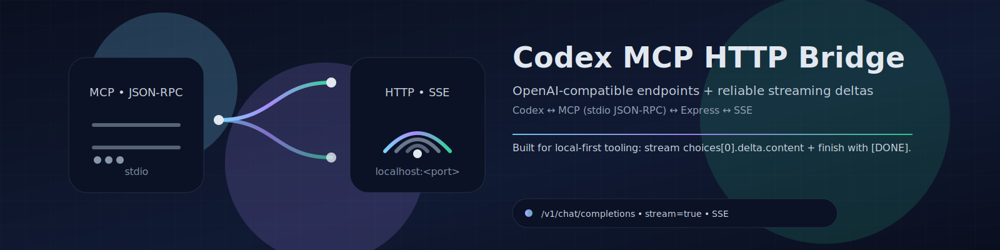

# Codex MCP HTTP Bridge



OpenAI-compatible HTTP + SSE “bridge” for Codex over MCP (JSON-RPC over stdio). This is designed to work with clients that expect OpenAI-style streaming (including Xcode Coding Intelligence).

## What You Get

- OpenAI-ish endpoints: models, chat completions (streaming + non-streaming), embeddings
- Streaming is delivered as `chat.completion.chunk` SSE events with `choices[0].delta.content`, and ends with `data: [DONE]`
- Codex is spawned as an MCP server process and spoken to over stdio

## Requirements

- Node.js `>= 18`
- `codex` installed and available on `PATH` (or set `CODEX_BIN`)

## Quickstart

```bash
npm ci
npm run build
npm start
```

Health check:

```bash
curl http://localhost:3333/health
```

## Endpoints

- `GET /health`
- `GET /v1/models`
- `POST /v1/chat/completions`
- `POST /v1/embeddings`

## Streaming (SSE) Example

This should print multiple `data: {...}` lines containing `choices[0].delta.content`, and end with `data: [DONE]`.

```bash
curl -N http://localhost:3333/v1/chat/completions \
  -H 'Content-Type: application/json' \
  -d '{"model":"gpt-5.2","stream":true,"messages":[{"role":"user","content":"Write 2 short sentences about TypeScript."}]}'
```

## Auth

If `API_KEY` is set, all OpenAI-compatible endpoints require it.

- Default header: `Authorization`
- Optional bearer enforcement: set `REQUIRE_BEARER=1` to require `Authorization: Bearer ...`

Example:

```bash
curl -N http://localhost:3333/v1/chat/completions \
  -H 'Content-Type: application/json' \
  -H 'Authorization: Bearer YOUR_KEY' \
  -d '{"model":"gpt-5.2","stream":true,"messages":[{"role":"user","content":"Say hello."}]}'
```

## Configuration

Core:

- `PORT` (default `3333`)
- `MODEL_ID` (default `gpt-5.2`)
- `CODEX_BIN` (default `codex`)
- `CODEX_PROFILE` (default `clean`)

Auth:

- `API_KEY` (optional)
- `API_KEY_HEADER` (default `authorization`)
- `REQUIRE_BEARER` (`1` to require `Authorization: Bearer ...`)

Streaming behavior:

- `RPC_TIMEOUT_MS` (default `1200000`)
- `SSE_KEEPALIVE_MS` (default `15000`)
- `STREAM_CHUNK_CHARS` (default `64`)
- `HARD_REQUEST_TIMEOUT_MS` (default `300000`)

Logging / debugging:

- `BRIDGE_LOG_REQUESTS` (`1` to log full inbound HTTP requests; default `0`)
- `BRIDGE_LOG_REQUESTS_REDACT` (`0` to disable redaction; default `1`)
- `CODEX_BRIDGE_LOG_EVENTS` (`0` to suppress very noisy per-event logs; default `1`)

System prompt handling (Xcode):

Some clients (notably Xcode) send very large `role: "system"` messages intended to drive their own internal tooling. When forwarded verbatim, those instructions can dominate the prompt and make Codex act overly cautious (e.g. “don’t write code yet”, “only respond with ##SEARCH: …”).

- `BRIDGE_SYSTEM_MESSAGES=all|none|first|last` (default `all`)
  - Default is `none` when `User-Agent` starts with `Xcode/` (unless explicitly overridden).
  - For Xcode, `none` is often best.
- `BRIDGE_SYSTEM_MAX_CHARS=<n>` (default `0` meaning “no limit”)
  - Applied per system message when `BRIDGE_SYSTEM_MESSAGES` includes any system messages.

## Tests & CI

Run the fast test suite (does not require Codex installed):

```bash
npm test
```

CI is defined in `.github/workflows/ci.yml` (Node 18/20/22 matrix).

## Smoke Test (End-to-End)

This repo includes an end-to-end streaming smoke script that starts the server, hits `/health`, runs a streaming `curl`, and asserts both streamed deltas and `[DONE]`:

```bash
npm run smoke
```

This requires Codex to be available (because it exercises the real MCP process).

## Architecture Notes

- The HTTP layer is built in `src/app.ts` so it’s testable without starting a real Codex process.
- Streaming comes from Codex JSON-RPC notifications (`codex/event`); the bridge forwards these as OpenAI-style SSE chunks.
- `src/server.ts` is wiring-only: it starts the MCP bridge and mounts the app.

More repo-specific rules live in `CONVENTIONS.md`.

## Support / Donate

If you find this useful, you can add your donation links via `.github/FUNDING.yml` (GitHub Sponsors and/or custom URLs). Once you populate that file, GitHub will display a “Sponsor” button on the repo.
